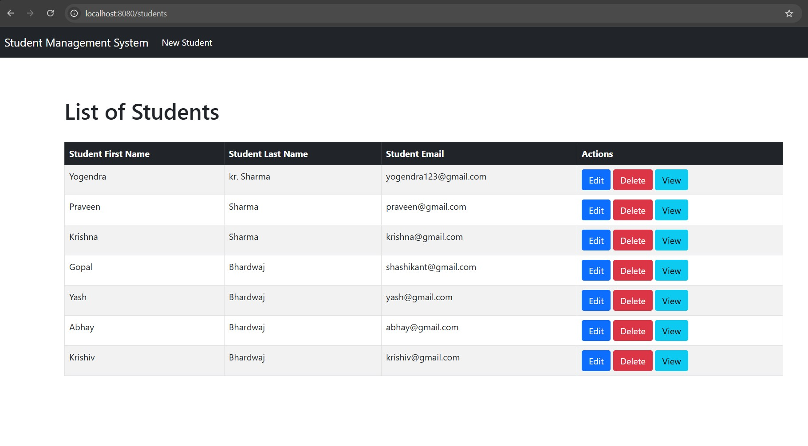
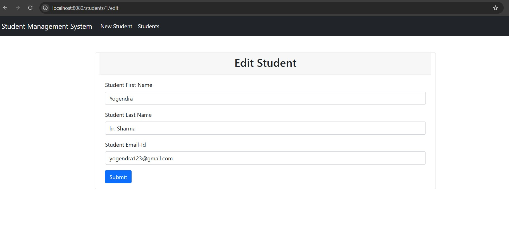
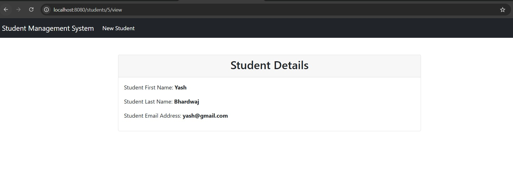

# Student Management System

A Spring Boot based Student Management System that allows users to manage student records using CRUD operations.

## 🚀 Features

- Add Student
- View All Students
- View Student Details
- Update Student Information
- Delete Student
- Responsive UI using Thymeleaf
- MySQL Database Integration

## 🛠️ Tech Stack

- Java 25
- Spring Boot
- Spring MVC
- Spring Data JPA
- Hibernate
- Thymeleaf
- MySQL
- Maven

## 📂 Project Structure

```
src
 ├── controller
 ├── service
 ├── repository
 ├── entity
 ├── dto
 ├── mapper
 └── resources
```

## ⚙️ How to Run

1. Clone the repository

```bash
git clone https://github.com/Yashbhardwaj1508/student-management-system.git
```

2. Create a MySQL database

```
sms
```

3. Set the database password using an environment variable:

```
DB_PASSWORD=your_mysql_password
```

4. Run the project

```
mvn spring-boot:run
```


## 📸 Screenshots

### Home Page



### Add Student


### Edit Student



### View Student



## 👨‍💻 Author

Yash Bhardwaj